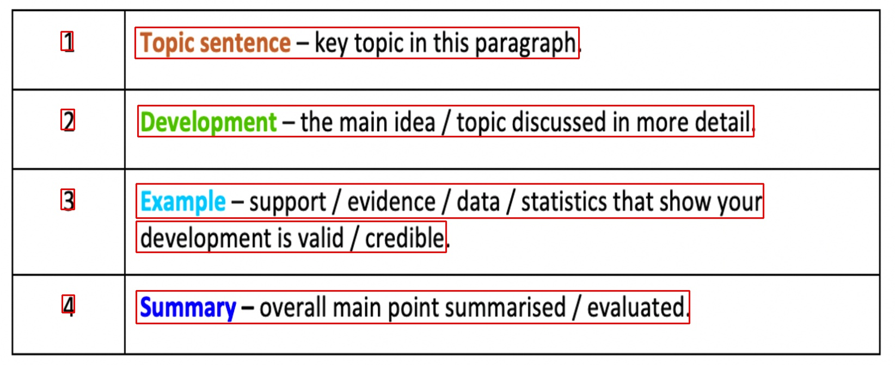

## CRAFT: Character-Region Awareness For Text detection
### CRAFT ONNX

- Origin repo: https://github.com/clovaai/CRAFT-pytorch

## Getting started
### Install dependencies
#### Requirements
- My Environment: 
    - pytorch 1.8.1+cu102
    - onnxruntime 1.10.0
    - check requirements.txt
```
pip install -r requirements.txt
```

## Convert Craftmlt25k.pth to onnx 
- Download model pth from origin repo: [craftmlt25k](https://drive.google.com/file/d/1Jk4eGD7crsqCCg9C9VjCLkMN3ze8kutZ/view) and push to folder weights
- Run:
```
CUDA_VISIBLE_DEVICES=0 python3 craft2onnx.py --craftmlt25kpthpath <craft_model_path.pth> --craftonnxpath <craft_model_onnx_save_path.onnx>
```

## Inference Craftmlt25k without refinet
- Run:
```
CUDA_VISIBLE_DEVICES=0 python3 infer_craft_without_refinet.py --craftonnxpath <craft_model_onnx_path.onnx> --image <image_path_inference>
```


## Convert Refinet.pth to onnx
- Download model pth from origin repo: [refinet](https://drive.google.com/file/d/1XSaFwBkOaFOdtk4Ane3DFyJGPRw6v5bO/view) and push to folder weights
- Run:
```
CUDA_VISIBLE_DEVICES=0 python3 craft2onnx.py --craftmlt25kpthpath <craft_model_path.pth> --refinetpthpath <refinet_model_path.pth> --refinetonnxpath <refinet_model_onnx_save_path.onnx>
```

## Inference Craft model with refinet 
- Run
```
CUDA_VISIBLE_DEVICES=0 python3 infer_craft_with_refinet.py --craftonnxpath <craft_model_onnx_path.onnx> --refineonnxpath <refinet_model_onnx_path.onnx> --image <image_path_inference>
```


## Test instruction using pretrained model
- Download the converted models

 *Model name* | *Used datasets* | *Languages* | *Purpose* | *Model ONNX Link* |
 | :--- | :--- | :--- | :--- | :--- |
General | SynthText, IC13, IC17 | Eng + MLT | For general purpose | [Click]()
LinkRefiner | CTW1500 | - | Used with the General Model | [Click](https://drive.google.com/file/d/1owsijdhNvodzXqE8ucZNAg69f7hjoMar/view?usp=share_link)

## REFERENCE
1. https://github.com/clovaai/CRAFT-pytorch